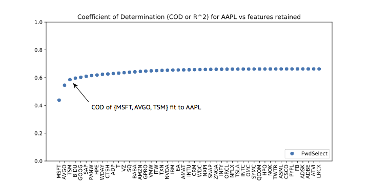

# `linselect` 

*Efficient linear stepwise regression* -- a fast, flexible, and performant
feature selection package for python.


## Package in a nutshell 
### It has a simple API
A simple API makes it easy to quickly rank a data set's features in terms of
their added value to a given fit.  This is demoed below, where we learn that we
can drop column `1` of `X` and still obtain a fit to `y` that captures 97.37%
of its variance.


```python
from linselect import FwdSelect 
import numpy as np

X = np.array([[1,2,4], [1,1,2], [3,2,1], [10,2,2]])
y = np.array([[1], [-1], [-1], [1]])

selector = FwdSelect()
selector.fit(X, y)

print selector.ordered_feature_list
print selector.cod_list
# [2, 0, 1] 
# [0.47368422, 0.97368419, 1.0]

X_compressed = X[:, selector.ordered_feature_list[:2]]
```

### It's fast 
A full sweep on a 1000 feature count data set runs in 10s on my laptop -- about
**one million times faster** (seriously) than standard stepwise algorithms,
which are effectively too slow to run at this scale.  A 100 count feature set
runs in 0.07s.

```python
from linselect import FwdSelect
import numpy as np
import time

X = np.random.randn(5000, 1000)
y = np.random.randn(5000, 1)

selector = FwdSelect()

t1 = time.time()
selector.fit(X, y)
t2 = time.time()
print t2 - t1
# 9.87492 
``` 

### Its scores reveal your effective feature count
By plotting fitted CODs against ranked feature count, one often learns that
seemingly high-dimensional problems can actually be understood using only a
minority of the available features.  The plot below demonstrates this: A fit to one year of AAPL's stock fluctuations -- using just 3
other stocks as predictors -- nearly matches the performance of a 49-feature fit.
The 3-feature fit arguably provides more insight and is certainly easier to
reason about (cf. tutorials for details).
 





### It's flexible 
`linselect` exposes multiple applications of the underlying algorithm.  These
allow for:
* Forward, reverse, and general forward-reverse stepwise regression strategies.
* Supervised applications aimed at a single target variable or simultaneous
  prediction of multiple target variables.
* Unsupervised applications.  The algorithm can be applied to identify minimal,
  representative subsets of an available column set.  This solution provides a
  feature selection analog of PCA -- importantly, one that retains
  interpretability.


## Under the hood
Feature selection algorithms are used to seek minimal column / feature subsets
that capture the majority of the useful information contained within a data
set. Removal of a selected subset's complement -- the relatively uninformative
or redundant features -- can often result in a significant data compression and
improved interpretability.

Stepwise selection algorithms work by iteratively updating a model feature set,
one at a time [1].  For example, in a given step of a forward process, one
considers all of the features that have not yet been added to the model, and
then identifies that which would improve the model the most.  This is added,
and the process is then repeated until all features have been selected.  The
features that are added first in this way tend to be those that are predictive
and also not redundant with those already included in the predictor set.
Retaining only these first selected features therefore provides a convenient
method for identifying minimal, informative feature subsets.

In general, identifying the optimal feature to add to a model in a given step
requires building and scoring each possible updated model variant.  This
results in a slow process: If there are `n` features, `O(n^2)` models must be
built to carry out a full ranking.  However, the process can be dramatically
sped up in the case of linear regression -- thanks to 
some linear algebra identities that allow one to efficiently update these
models as features are either added or removed from their predictor sets [2,3].
Using these update rules, a full feature ranking can be carried out in roughly
the same amount of time that is needed to fit only a single model.  For
`n=1000`, this means we get an `O(n^2) = O(10^6)` speed up!  `linselect` makes
use of these update rules -- first identified in [2] --  allowing for fast
feature selection sweeps.

[1] Introduction to Statistical Learning by G. James, et al -- cf. chapter 6.

[2] M. Efroymson. Multiple regression analysis. *Mathematical methods for
digital computers*, 1:191–203, 1960.

[3] J. Landy. Stepwise regression for unsupervised learning, 2017.
[arxiv.1706.03265](https://arxiv.org/abs/1706.03265).


## Classes, documentation, tests, license
`linselect` contains three classes: `FwdSelect`, `RevSelect`, and `GenSelect`.
As the names imply, these support efficient forward, reverse, and general
forward-reverse search protocols, respectively.  Each can be used for both
supervised and unsupervised analyses.

Docstrings and basic call examples are illustrated for each class in the
[./docs](docs/) folder.

A running list of tutorials are also available at
[efavdb.com/linselect](http://www.efavdb.com/linselect).

Tests: From the root directory,

```
python setup.py test
``` 

This project is licensed under the terms of the MIT license.

## Installation 
The package can be installed using pip, either from pypi

```
pip install linselect
```

or from github

```
pip install git+git://github.com/efavdb/linselect.git
```


## Author

**Jonathan Landy** - [EFavDB](http://www.efavdb.com)

Acknowledgments: Special thanks to P. Callier, P. Spanoudes, and R. Zhou for
providing helpful feedback.
